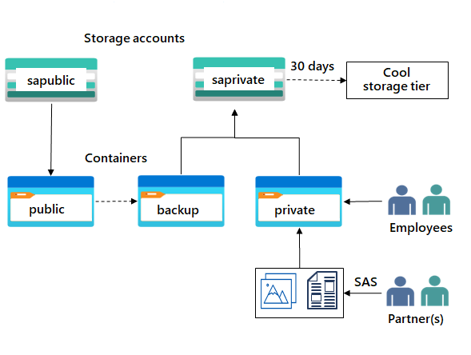

---
lab:
  title: '演習 02b: 社内ドキュメント用のプライベート ストレージを提供する'
  module: Guided Project - Azure Files and Azure Blobs
---

会社は、オフィスおよび部門用のストレージを必要としています。 この内容は会社のプライベートなものであり、同意なしに共有することはできません。 このストレージには、リージョンの停止が発生した場合の高可用性が必要です。 会社は、このストレージを使用してパブリック Web サイトをバックアップしたいと考えています。 

## アーキテクチャ ダイアグラム

## スキルアップ タスク
- 会社の非公開ドキュメント用ストレージ アカウントを作成します。
- ストレージ アカウントの冗長性を構成します。 
- 共有アクセス署名を構成して、パートナーがファイルへのアクセスを制限できるようにします。 
- パブリック Web サイト ストレージをバックアップします。
- ライフサイクル管理を実装して、コンテンツをクール層に移動します。

## 演習の手順

> **注**: これらの手順では、ラボ 02a** を完了**し、内部ドキュメントのストレージを提供する必要があります。

## ストレージ アカウントを作成し、高可用性を構成します。

1. 会社の非公開の社内ドキュメント用ストレージ アカウントを作成します。
    - ポータルで、「**ストレージ アカウント**」と検索して選択します。  
    - **[+ 作成]** を選択します。 
    - 前のラボで作成した**リソース グループ**を選択します。   
    - **ストレージ アカウント**名に `private` を設定します。 名前に識別子を追加して、名前が一意であることを確認します。 
    - **[確認]** を選択して、ストレージ アカウントを**作成**します。 
    - ストレージ アカウントがデプロイされるのを待って、**[リソースに移動]** を選択します。

1. このストレージには、リージョンの停止が発生した場合の高可用性が必要です。 セカンダリ リージョンでの読み取りアクセスは必要ありません。 適切なレベルの **[冗長性]** を構成します。 

    - ストレージ アカウントの **[データ管理]** セクションで、**[冗長性]** ブレードを選択します。 
    - 必ず、**[geo 冗長ストレージ (GRS)]** を選択します。
    - ページを**最新の情報に更新**します。 
    - プライマリとセカンダリの場所の情報を確認します。 
    - 変更内容を**保存**します。

## ストレージ コンテナーを作成し、ファイルをアップロードし、ファイルへのアクセスを制限します。 

1. 会社データ用のプライベート ストレージ コンテナーを作成します。 

    - ストレージ アカウントの **[データ ストレージ]** セクションで、**[コンテナー]** ブレードを選択します。 
    - **[+ コンテナー]** を選択します。 
    - コンテナーの**名前**が `private` であることを確認します。
    - **[パブリック アクセス レベル]** が **[プライベート (匿名アクセスなし)]** であることを確認します。
    - 時間があれば、**詳細**設定を確認しますが、既定値のままにしてください。 
    - **［作成］** を選択します 

1.  テストの場合、ファイルを**非公開**コンテナーにアップロードします。 ファイルの種類は関係ありません。 小さなイメージまたはテキスト ファイルを選択することをお勧めします。 ファイルがパブリックにアクセスできないことをテストして確認します。 

    - コンテナーを選択します。
    - **[アップロード]** を選択します。
    - **ファイルを参照して**ファイルを選択します。
    - ファイルを**アップロード**します。
    - アップロードしたファイルを選択します。
    - **[概要]** タブで、**URL** をコピーします。
    - この **URL** を新しいブラウザー タブに貼り付けます。 
    - ファイルが表示されないので、エラーが表示されていることを確認します。 

1. 外部パートナーは、少なくとも今後 24 時間、ファイルへの読み取りおよび書き込みアクセスを必要とします。 Shared Access Signature (SAS) を構成してテストします。 [Shared Access Signatures](https://learn.microsoft.com/azure/storage/common/storage-sas-overview) に関する詳細を確認します。

    - アップロードしたファイルを選択し、**[SAS の生成]** タブに移動します。 
    - **[アクセス許可]** ドロップダウンで、パートナーが**読み取り**アクセス許可のみを持っていることを確認します。
    - **[開始日時と有効期限の日時]** が今後 24 時間であることを確認します。 
    - **[SAS トークンと URL の生成]** を選択します。
    - **BLOB の SAS URL** 新しいブラウザー タブにコピーします。
    - ファイルにアクセスできないことを確認します。 画像ファイルをアップロードした場合は、ブラウザーに表示されます。 その他の種類のファイルをダウンロードします。

## ストレージ アクセス層とコンテンツ レプリケーションを構成します。

1. コストを節約するために、30 日後、BLOB をホット層からクール層に移動します。 [Azure Blob Storage](https://learn.microsoft.com/azure/storage/blobs/lifecycle-management-policy-configure?tabs=azure-portal) ライフサイクルを管理する方法に関する詳細を確認します。

    - **ストレージ アカウント**に戻ります。
    - **[概要]** セクションで、**[既定のアクセス層]** が **[ホット]** に設定されていることを確認します。 
    - **[データ管理]** セクションで、**[ライフサイクル管理]** ブレードを選択します。
    - **[ルールの追加]** を選択します。 
    - **ルール名前**を `movetocool` に設定します。
    - **[ルール スコープ]** を **[ストレージ アカウント内のすべての BLOB にルールを適用]** に設定します。
    - **[次へ]** を選択します。
    - **[最終更新日時]** が選択されていることを確認します。
    - **[次の日数以上前]** を **30** に設定します。
    - **[次に]** ドロップダウンで、**[クール層に移動する]** を選択します。
    - 時間があれば、ドロップダウンで他のライフサイクル オプションを確認します。 
    - ルールを**追加**します。
  
1. パブリック Web サイトのファイルは、別のストレージ アカウントにバックアップする必要があります。[オブジェクト レプリケーション](https://learn.microsoft.com/azure/storage/blobs/object-replication-configure?tabs=portal)に関する詳細を確認します。

    - ストレージ アカウントで、`backup` という名前の新しいコンテナーを**作成**します。 既定値を使用します。 詳細な手順が必要な場合は、ラボ 02a に戻ってください。 
    - **publicwebsite** ストレージ アカウントに移動します。 このストレージ アカウントは、前の演習で作成されました。 
        - **[データ管理]** セクションで、**[オブジェクト レプリケーション]** ブレードを選択します。 
        - **[レプリケーション ルールの作成]** を選択します。
        - **宛先ストレージ アカウント**を **private** ストレージ アカウントに設定します。
        - **[ソース コンテナー]** を **public** に設定し、**[宛先コンテナー]** を **backup** に設定します。
        - **[作成]** をクリックしてレプリケーション ルールを作成します。 
    - 必要に応じて、時間があれば、ファイルを **public** コンテナーにアップロードします。 **private** ストレージ アカウントに戻り、**backup** コンテナーを更新します。 数分以内に、パブリック Web サイト ファイルがバックアップ フォルダーに表示されます。 

>**注**: さらに演習をするには、「[Azure BLOB ストレージの構成](https://learn.microsoft.com/training/modules/configure-blob-storage/)」モジュールを完了してください。 モジュールには対話型のラボ シミュレーションがあり、BLOB ストレージの作成を演習できます。 

## Copilot を使用して学習を拡張する

Copilot は、あなたの学習体験に役立ちます。 Copilot では、基本的な技術情報、手順の概要、長所と短所、トラブルシューティングのヘルプ、使用例、コーディング例などを提供できます。 Copilot にアクセスするには、Edge ブラウザーを開き、Copilot (右上) を選択します。 次のプロンプトを試すには数分かかります。
+ Azure Storage の保護に使用できるセキュリティ機能は何ですか?
+ Azure SAS とは何ですか? また、どのように使用しますか?

## 自習トレーニングでさらに学習する

+ [Azure Storage のセキュリティの構成](https://learn.microsoft.com/training/modules/configure-storage-security/) このモジュールでは、ストレージ アクセス署名などの一般的な Azure Storage セキュリティ機能を構成する方法を説明します。
+ [Azure Blob Storage のライフサイクルの管理](https://learn.microsoft.com/training/modules/configure-storage-security/) このモジュールでは、Azure BLOB Storage のライフサイクル全体を通じてデータの可用性を管理する方法について説明します。

## 要点

以上でラボは完了です。 このラボの要点は次のとおりです。 
+ Azure Storage には、暗号化、アクセスの制御、ネットワーク セキュリティ、監視、アラートなど、多くのデータ保護機能があります。 
+ Shared Access Signature (SAS) を使用すると、ストレージ アカウント内のリソースへのセキュリティで保護された委任アクセスが可能になります。 SAS を使用すると、クライアントがデータにアクセスする方法をきめ細かく制御できます。
+ Azure Blob Storage のライフサイクル管理にはルールベースのポリシーが用意されており、これを使用すると、最適なアクセス層に BLOB データを移行したり、データ ライフサイクルの最後にデータを期限切れにしたりすることができます。
+ オブジェクト レプリケーションを使用すると、ソース ストレージ アカウントと宛先アカウントの間でブロック BLOB を非同期にコピーできます。
