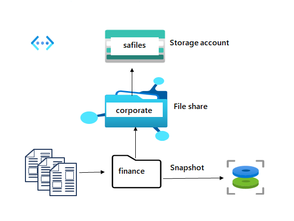

---
lab:
  title: '演習 03: 会社のオフィスの共有ファイル ストレージを提供する'
  module: Guided Project - Azure Files and Azure Blobs
---

会社は地理的に異なる場所にオフィスを分散しています。  これらのオフィスには、ファイルを共有し、情報を配布する方法が必要です。 たとえば、財務部門は、監査とコンプライアンスのコスト情報を確認する必要があります。 このファイル共有は、遅延なく簡単にアクセスして読み込むことができる必要があります。 一部のコンテンツには、選択した企業仮想ネットワークからのみアクセスする必要があります。

## アーキテクチャ ダイアグラム

## スキルアップ タスク
- ファイル共有専用のストレージ アカウントを作成します。 
- ファイル共有とディレクトリを構成します。  
- スナップショットを構成し、ファイルの復元を演習します。 
- 特定の仮想ネットワークとサブネットへのアクセスを制限します。 

## 演習の手順

>**注**: このラボを完了するには、[Azure サブスクリプション](https://azure.microsoft.com/free/)が必要です。

## Azure Files 用のストレージ アカウントを作成して構成します。 

1. 財務部門の共有ファイル用にストレージ アカウントを作成します。  [Azure Files デプロイ](https://learn.microsoft.com/azure/storage/files/storage-files-planning#management-concepts)のストレージ アカウントに関する詳細を確認します。

    - ポータルで、`Storage accounts` を検索して選択します。
    - **[+ 作成]** を選択します。
    - **リソース グループ**で **[新規作成]** を選択します。 リソース グループに**名前**を付け、**[OK]** を選択して、変更内容を保存します。 
    - **[ストレージ アカウント名]** を指定します。 名前が名前付け要件を満たしていることを確認します。 
    - **[パフォーマンス]** を **[Premium]** に設定します。
    - **[Premium アカウントの種類]** を **[ファイル共有]** に設定します。
    - **[冗長性]** を **[ゼロ冗長ストレージ]** に設定します。
    - **[確認]** を選択してストレージ アカウントを**作成**します。
    - リソースがデプロイされるまで待ちます。
    - **[リソースに移動]** を選択します。 

## ディレクトリを使用してファイル共有を作成して構成します。

1. 会社のオフィスのファイル共有を作成します。 [Azure File 層](https://learn.microsoft.com/azure/storage/files/storage-files-planning#storage-tiers)に関する詳細を確認します。

    - ストレージ アカウントの **[データ ストレージ]** セクションで、**[ファイル共有]** ブレードを選択します。 
    - **[+ ファイル共有]** を選択し、**名前**を指定します。
    - 他のオプションを確認しますが、既定値を使用します。
    - **[作成]** を選択します

1. 財務部門のファイル共有にディレクトリを追加します。 今後のテストのために、ファイルをアップロードします。 

    - ファイル共有を選択し、**[+ ディレクトリの追加]** を選択します。 
    - 新しいディレクトリに `finance` という名前を付けます。
    - **[参照]** を選択し、**finance**ディレクトリを選択します。
    - **ディレクトリを追加**して、ファイル共有をさらに整理できることに注意してください。
    - 選択したファイルを**アップロード** します。 

## スナップショットを構成してテストします。

1. BLOB ストレージと同様に、ファイルを誤って削除しないように保護する必要があります。 スナップショットを使うことにします。 [ファイル スナップショット](https://learn.microsoft.com/azure/storage/files/storage-snapshots-files)に関する詳細を確認します。
    
    - ファイル共有を選択します。
    - **[操作]** セクションで、**[スナップショット]** ブレードを選択します。 
    - **[+ スナップショットの追加]** を選択します。 コメントは省略可能です。 **[OK]** を選択します。
    - スナップショットを選択し、ファイル ディレクトリとアップロードされたファイルが含まれていることを確認します。
  
1. スナップショットを使用してファイルの復元を演習します。
    - **ファイル共有**に戻ります。
    - ファイル ディレクトリを**参照**します。 
    - アップロードしたファイルを検索し、**[プロパティ]** ペインで **[削除]** を選択します。 **[はい]** を選択して、削除を確認します。 
    - **[スナップショット]** ブレードを選択し、自分のスナップショットを選択します。 
    - 復元するファイルに移動します。
    - ファイルを選択し、**[復元]** を選択します。
    - **復元されたファイル名**を指定します。 
    - ファイル ディレクトリに復元されたファイルがあることを確認します。  

## 選択した仮想ネットワークへのストレージ アクセスの制限を構成します。

1. このセクションのタスクには、サブネットを含む仮想ネットワークが必要です。 運用環境では、これらのリソースは既に作成されています。
    - **仮想ネットワーク**を検索して選択します。
        - **［作成］** を選択します。 リソース グループを選択します。 仮想ネットワークに**名前**を付けます。
        - 他のパラメーターの既定値を使用して、**[確認および作成]** を選択し、**[作成]** を選択します。
        - リソースがデプロイされるまで待ちます。
        - **[リソースに移動]** を選択します。 
    - **[設定]** セクションで、**[サブネット]** ブレードを選択します。
        - **既定の**サブネットを選択します。
        - **[サービス エンドポイント]** セクションの **[サービス]** ドロップダウンで **Microsoft.Storage** を選択します。
        - 他の変更を加えないでください。    
        - 変更を必ず**保存**してください。 
   
1. ストレージ アカウントには、先ほど作成した仮想ネットワークからのみアクセスする必要があります。 [プライベート ストレージ エンドポイント](https://learn.microsoft.com/azure/storage/common/storage-private-endpoints)の使用に関する詳細を確認します。

    - 自分の**ファイル ストレージ アカウント**に戻ります。 
    - **[セキュリティとネットワーク]** セクションで、**[ネットワーク]** ブレードを選択します。
        - **[公開用ネットワーク アクセス]** を **[選択した仮想ネットワークと IP アドレスから有効]** に変更します。
        - **[仮想ネットワーク]** セクションで **[既存の仮想ネットワークを追加]** を選択します。
        - 仮想ネットワークとサブネットを選択し、**[追加]** を選択します。
        - 変更を必ず**保存**してください。 
    - **[Storage ブラウザー]** を選択し、ファイル共有に移動します。 
    - 「*この操作を行う権限がありません*」というメッセージを確認します。 仮想ネットワークから接続していません。 

>**注**: さらに演習するには、「[Azure ストレージ セキュリティの構成](https://learn.microsoft.com/training/modules/configure-storage-security/)」モジュールを完了してください。 このモジュールには、セキュリティで保護されるストレージの作成を演習できる対話型のラボ シミュレーションがあります。 

## Copilot を使用して学習を拡張する

Copilot は、あなたの学習体験に役立ちます。 Copilot では、基本的な技術情報、手順の概要、長所と短所、トラブルシューティングのヘルプ、使用例、コーディング例などを提供できます。 Copilot にアクセスするには、Edge ブラウザーを開き、Copilot (右上) を選択します。 次のプロンプトを試すには数分かかります。
+ Azure ファイル ストレージとは何ですか? また、Azure Blob Storage とはどのような違いがありますか? どちらを使用するかはどのように決めますか?
+ Azure のファイル コンテンツをセキュリティで保護するさまざまな方法は何ですか?

## 自習トレーニングでさらに学習する

+ [Azure Files と Azure File Sync を構成](https://learn.microsoft.com/en-us/training/modules/configure-azure-files-file-sync/)。このモジュールでは、Azure ファイル共有とファイル共有スナップショットを構成する方法について説明しています。

## 要点

以上でラボは完了です。 このラボの要点は次のとおりです。 
+ Azure Files では、業界標準のサーバー メッセージ ブロック (SMB) プロトコル、ネットワーク ファイル システム (NFS) プロトコル、および Azure Files REST API を介してアクセスできる、フル マネージドのファイル共有がクラウド上で提供されます。
+ Azure Files には、SMB と NFS のファイル共有のスナップショットを作成する機能があります。 共有スナップショットは、その時点の共有状態をキャプチャします。 共有スナップショットは、ファイル レベルの保護のみを提供します。
+ Azure ファイル共有に直接アクセスするためのストレージ アカウント エンドポイントを構成できます。 ストレージ アカウントへのネットワーク アクセスを制限するエンドポイントです。

